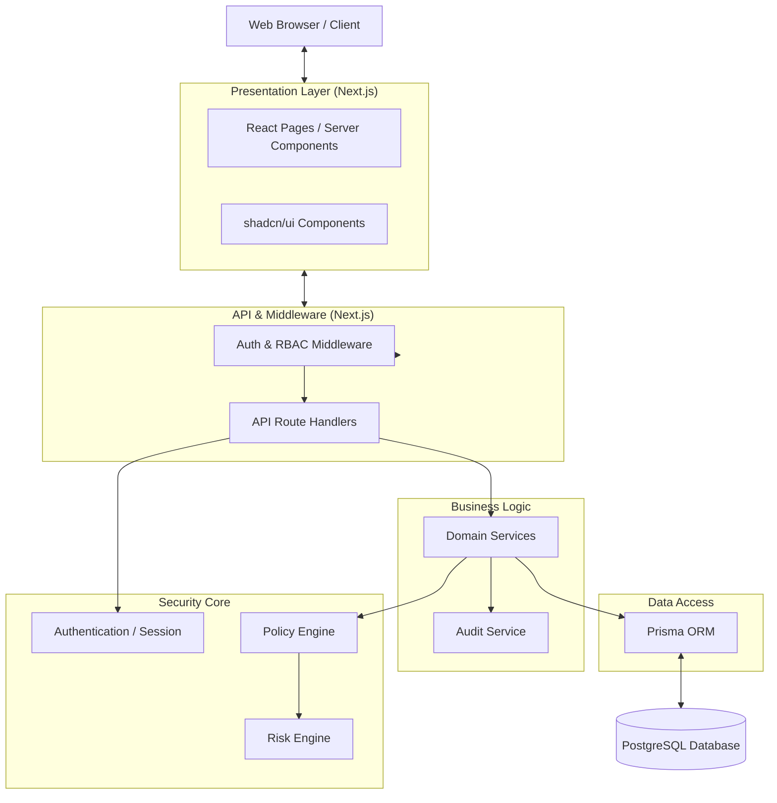

# ZTAP Architecture Diagram

```mermaid
flowchart TD
    Browser[Web Browser / Client]
    
    subgraph Presentation["Presentation Layer (Next.js)"]
        Pages[React Pages / Server Components]
        UI[shadcn/ui Components]
    end
    
    subgraph API["API & Middleware (Next.js)"]
        Middleware[Auth & RBAC Middleware]
        Routes[API Route Handlers]
    end
    
    subgraph Security["Security Core"]
        Auth[Authentication / Session]
        PolicyEngine[Policy Engine]
        RiskEngine[Risk Engine]
    end
    
    subgraph Business["Business Logic"]
        Services[Domain Services]
        Audit[Audit Service]
    end
    
    subgraph Data["Data Access"]
        Prisma[Prisma ORM]
    end
    
    Database[(PostgreSQL Database)]

    Browser <--> Presentation
    Presentation <--> API
    API --> Middleware
    Middleware --> Routes
    Routes --> Auth
    Routes --> Services
    Services --> PolicyEngine
    PolicyEngine --> RiskEngine
    Services --> Audit
    Services --> Prisma
    Prisma <--> Database
```
