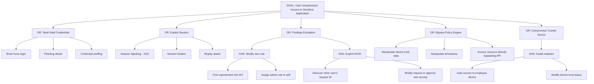

```mermaid
graph TD
    Goal[GOAL: Gain Unauthorized Access to Sensitive Application]
    Goal --> Steal[OR: Steal Valid Credentials]
    Goal --> Session[OR: Exploit Session]
    Goal --> PrivEsc[OR: Privilege Escalation]
    Goal --> Bypass[OR: Bypass Policy Engine]
    Goal --> Device[OR: Compromise Trusted Device]

    Steal --> Brute[Brute force login]
    Steal --> Phish[Phishing attack]
    Steal --> Stuff[Credential stuffing]

    Session --> XSS[Session hijacking - XSS]
    Session --> Fix[Session fixation]
    Session --> Replay[Replay attack]

    PrivEsc --> Role[AND: Modify own role]
    PrivEsc --> IDOR[AND: Exploit IDOR]

    Role --> R1[Find unprotected role API]
    Role --> R2[Assign admin role to self]

    IDOR --> I1[Discover other user's request ID]
    IDOR --> I2[Modify request to approve own access]

    Bypass --> B1[Manipulate device trust data]
    Bypass --> B2[Manipulate timestamp]
    Bypass --> B3[Access resource directly bypassing API]

    Device --> Malware[AND: Install malware]
    Malware --> M1[Gain access to employee device]
    Malware --> M2[Modify device trust status]
```
