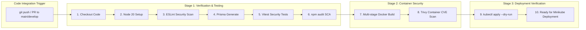

# ZTAP DevSecOps CI/CD Pipeline Diagram

```mermaid
flowchart LR
    subgraph Trigger ["Code Integration Trigger"]
        Push["git push / PR to main/develop"]
    end

    subgraph Stage1 ["Stage 1: Verification & Testing"]
        Checkout["1. Checkout Code"]
        Setup["2. Node 20 Setup"]
        Lint["3. ESLint Security Scan"]
        PrismaGen["4. Prisma Generate"]
        UnitTests["5. Vitest Security Tests"]
        Audit["6. npm audit SCA"]
    end

    subgraph Stage2 ["Stage 2: Container Security"]
        DockerBuild["7. Multi-stage Docker Build"]
        TrivyScan["8. Trivy Container CVE Scan"]
    end

    subgraph Stage3 ["Stage 3: Deployment Verification"]
        K8sVal["9. kubectl apply --dry-run"]
        DeployArtifact["10. Ready for Minikube Deployment"]
    end

    Push --> Checkout
    Checkout --> Setup
    Setup --> Lint
    Lint --> PrismaGen
    PrismaGen --> UnitTests
    UnitTests --> Audit
    Audit --> DockerBuild
    DockerBuild --> TrivyScan
    TrivyScan --> K8sVal
    K8sVal --> DeployArtifact
```
