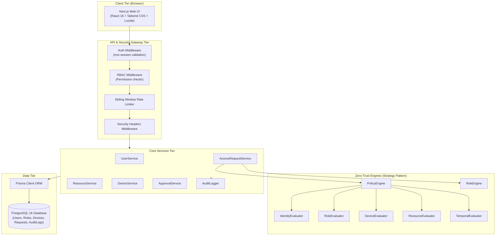

# ZTAP Component Diagram

```mermaid
graph TD
    subgraph Client ["Client Tier (Browser)"]
        UI["Next.js Web UI\n(React 18 + Tailwind CSS + Lucide)"]
    end

    subgraph Gateway ["API & Security Gateway Tier"]
        AuthMid["Auth Middleware\n(iron-session validation)"]
        RBACMid["RBAC Middleware\n(Permission checks)"]
        RateLim["Sliding Window Rate Limiter"]
        SecHeaders["Security Headers Middleware"]
    end

    subgraph CoreServices ["Core Services Tier"]
        UserSvc["UserService"]
        ResSvc["ResourceService"]
        DevSvc["DeviceService"]
        ReqSvc["AccessRequestService"]
        ApprSvc["ApprovalService"]
        AuditSvc["AuditLogger"]
    end

    subgraph SecurityEngines ["Zero-Trust Engines (Strategy Pattern)"]
        PolEngine["PolicyEngine"]
        RiskEngine["RiskEngine"]
        IdEval["IdentityEvaluator"]
        RoleEval["RoleEvaluator"]
        DevEval["DeviceEvaluator"]
        ResEval["ResourceEvaluator"]
        TempEval["TemporalEvaluator"]
    end

    subgraph Persistence ["Data Tier"]
        PrismaORM["Prisma Client ORM"]
        PostgresDB[("PostgreSQL 16 Database\n(Users, Roles, Devices, Requests, AuditLogs)")]
    end

    UI --> AuthMid
    AuthMid --> RBACMid
    RBACMid --> RateLim
    RateLim --> SecHeaders
    SecHeaders --> CoreServices

    ReqSvc --> PolEngine
    ReqSvc --> RiskEngine
    PolEngine --> IdEval
    PolEngine --> RoleEval
    PolEngine --> DevEval
    PolEngine --> ResEval
    PolEngine --> TempEval

    CoreServices --> AuditSvc
    CoreServices --> PrismaORM
    PrismaORM --> PostgresDB
```
