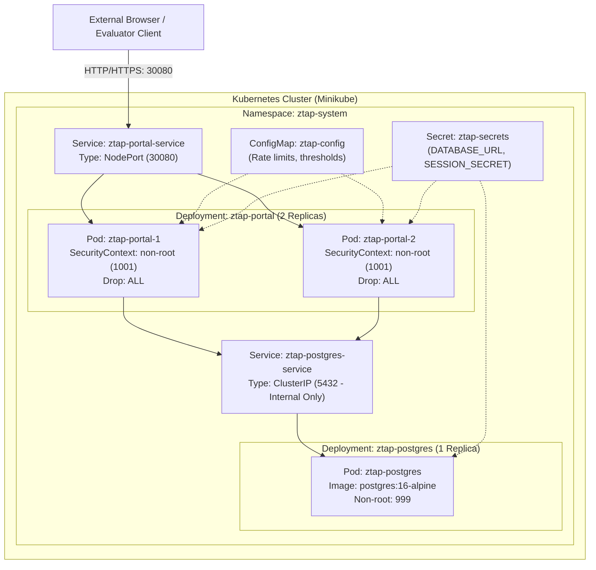

# ZTAP Kubernetes Deployment Diagram

```mermaid
graph TB
    subgraph MinikubeCluster ["Kubernetes Cluster (Minikube)"]
        subgraph Namespace ["Namespace: ztap-system"]
            subgraph PortalDeployment ["Deployment: ztap-portal (2 Replicas)"]
                Pod1["Pod: ztap-portal-1\nSecurityContext: non-root (1001)\nDrop: ALL"]
                Pod2["Pod: ztap-portal-2\nSecurityContext: non-root (1001)\nDrop: ALL"]
            end

            subgraph DBDeployment ["Deployment: ztap-postgres (1 Replica)"]
                DBPod["Pod: ztap-postgres\nImage: postgres:16-alpine\nNon-root: 999"]
            end

            PortalSvc["Service: ztap-portal-service\nType: NodePort (30080)"]
            DBSvc["Service: ztap-postgres-service\nType: ClusterIP (5432 - Internal Only)"]

            ConfigMap["ConfigMap: ztap-config\n(Rate limits, thresholds)"]
            Secret["Secret: ztap-secrets\n(DATABASE_URL, SESSION_SECRET)"]
        end
    end

    Client["External Browser / Evaluator Client"] -->|HTTP/HTTPS: 30080| PortalSvc
    PortalSvc --> Pod1
    PortalSvc --> Pod2

    Pod1 --> DBSvc
    Pod2 --> DBSvc
    DBSvc --> DBPod

    ConfigMap -.-> Pod1
    ConfigMap -.-> Pod2
    Secret -.-> Pod1
    Secret -.-> Pod2
    Secret -.-> DBPod
```
