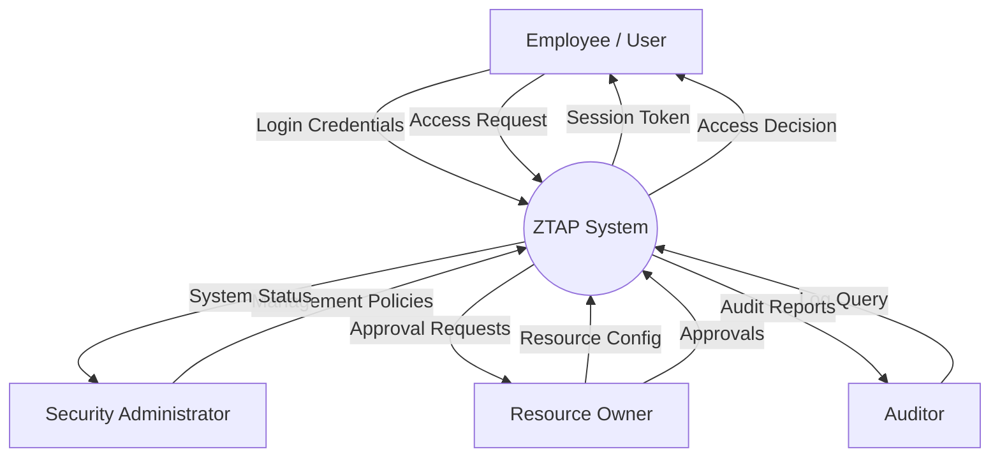

```mermaid
flowchart TD
    %% External Entities
    Emp[Employee / User]
    Admin[Security Administrator]
    RO[Resource Owner]
    Auditor[Auditor]

    %% Process 0
    ZTAP((ZTAP System))

    %% Data Flows
    Emp -- Login Credentials --> ZTAP
    ZTAP -- Session Token --> Emp
    Emp -- Access Request --> ZTAP
    ZTAP -- Access Decision --> Emp

    Admin -- Management Policies --> ZTAP
    ZTAP -- System Status --> Admin

    RO -- Resource Config --> ZTAP
    ZTAP -- Approval Requests --> RO
    RO -- Approvals --> ZTAP

    Auditor -- Log Query --> ZTAP
    ZTAP -- Audit Reports --> Auditor
```
