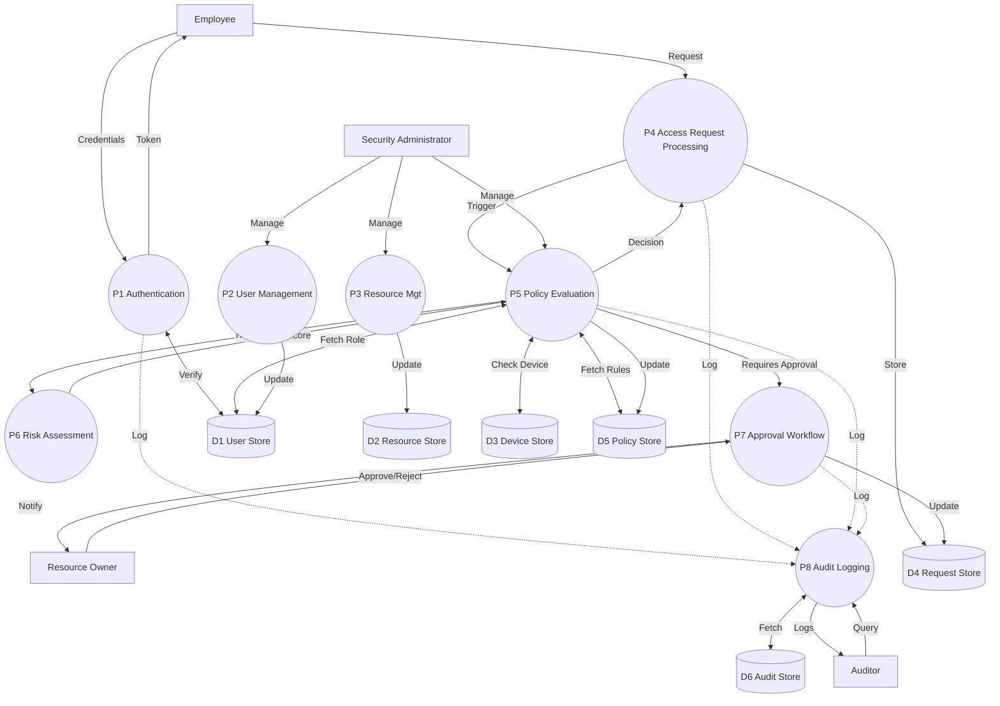

```mermaid
flowchart TD
    %% External Entities
    Emp[Employee]
    Admin[Security Administrator]
    RO[Resource Owner]
    Auditor[Auditor]

    %% Processes
    P1((P1 Authentication))
    P2((P2 User Management))
    P3((P3 Resource Mgt))
    P4((P4 Access Request Processing))
    P5((P5 Policy Evaluation))
    P6((P6 Risk Assessment))
    P7((P7 Approval Workflow))
    P8((P8 Audit Logging))

    %% Data Stores
    D1[(D1 User Store)]
    D2[(D2 Resource Store)]
    D3[(D3 Device Store)]
    D4[(D4 Request Store)]
    D5[(D5 Policy Store)]
    D6[(D6 Audit Store)]

    %% Flows
    Emp -->|Credentials| P1
    P1 <-->|Verify| D1
    P1 -->|Token| Emp

    Emp -->|Request| P4
    P4 -->|Store| D4
    P4 -->|Trigger| P5

    P5 <-->|Fetch Rules| D5
    P5 <-->|Fetch Role| D1
    P5 <-->|Check Device| D3
    P5 -->|Trigger| P6
    P6 -->|Calculate Score| P5

    P5 -->|Decision| P4
    P5 -->|Requires Approval| P7
    P7 -->|Notify| RO
    RO -->|Approve/Reject| P7
    P7 -->|Update| D4

    Admin -->|Manage| P2
    P2 -->|Update| D1
    Admin -->|Manage| P5
    P5 -->|Update| D5
    Admin -->|Manage| P3
    P3 -->|Update| D2

    Auditor -->|Query| P8
    P8 <-->|Fetch| D6
    P8 -->|Logs| Auditor

    P1 -.->|Log| P8
    P4 -.->|Log| P8
    P5 -.->|Log| P8
    P7 -.->|Log| P8
```
