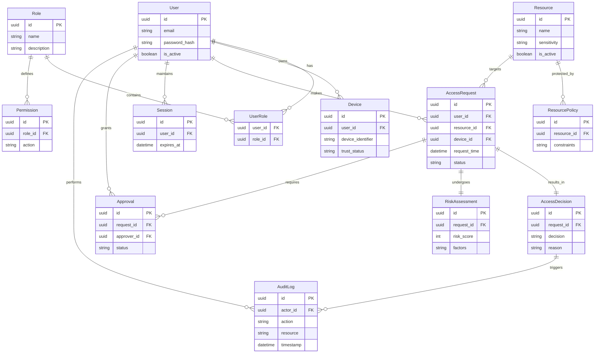

```mermaid
erDiagram
    User ||--o{ UserRole : has
    User ||--o{ Device : owns
    User ||--o{ AccessRequest : makes
    User ||--o{ Session : maintains
    User ||--o{ Approval : grants
    Role ||--o{ UserRole : contains
    Role ||--o{ Permission : defines
    Resource ||--o{ ResourcePolicy : protected_by
    Resource ||--o{ AccessRequest : targets
    AccessRequest ||--|| AccessDecision : results_in
    AccessRequest ||--|| RiskAssessment : undergoes
    AccessRequest ||--o{ Approval : requires
    User ||--o{ AuditLog : performs
    AccessDecision ||--o{ AuditLog : triggers

    User {
        uuid id PK
        string email
        string password_hash
        boolean is_active
    }
    Role {
        uuid id PK
        string name
        string description
    }
    Permission {
        uuid id PK
        uuid role_id FK
        string action
    }
    UserRole {
        uuid user_id FK
        uuid role_id FK
    }
    Device {
        uuid id PK
        uuid user_id FK
        string device_identifier
        string trust_status
    }
    Resource {
        uuid id PK
        string name
        string sensitivity
        boolean is_active
    }
    ResourcePolicy {
        uuid id PK
        uuid resource_id FK
        string constraints
    }
    AccessRequest {
        uuid id PK
        uuid user_id FK
        uuid resource_id FK
        uuid device_id FK
        datetime request_time
        string status
    }
    AccessDecision {
        uuid id PK
        uuid request_id FK
        string decision
        string reason
    }
    RiskAssessment {
        uuid id PK
        uuid request_id FK
        int risk_score
        string factors
    }
    Approval {
        uuid id PK
        uuid request_id FK
        uuid approver_id FK
        string status
    }
    AuditLog {
        uuid id PK
        uuid actor_id FK
        string action
        string resource
        datetime timestamp
    }
    Session {
        uuid id PK
        uuid user_id FK
        datetime expires_at
    }
```
