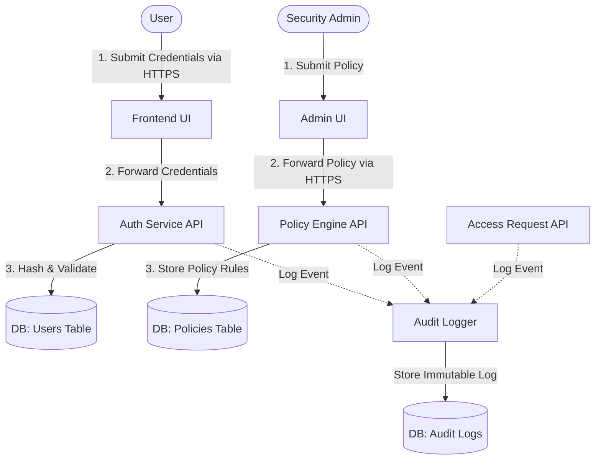

```mermaid
flowchart TD
    User([User]) -->|1. Submit Credentials via HTTPS| Frontend[Frontend UI]
    Frontend -->|2. Forward Credentials| AuthAPI[Auth Service API]
    AuthAPI -->|3. Hash & Validate| DB_Users[(DB: Users Table)]
    
    Admin([Security Admin]) -->|1. Submit Policy| FrontendAdmin[Admin UI]
    FrontendAdmin -->|2. Forward Policy via HTTPS| PolicyAPI[Policy Engine API]
    PolicyAPI -->|3. Store Policy Rules| DB_Policies[(DB: Policies Table)]
    
    AuthAPI -.->|Log Event| AuditService[Audit Logger]
    PolicyAPI -.->|Log Event| AuditService
    AccessAPI[Access Request API] -.->|Log Event| AuditService
    AuditService -->|Store Immutable Log| DB_Logs[(DB: Audit Logs)]
```
