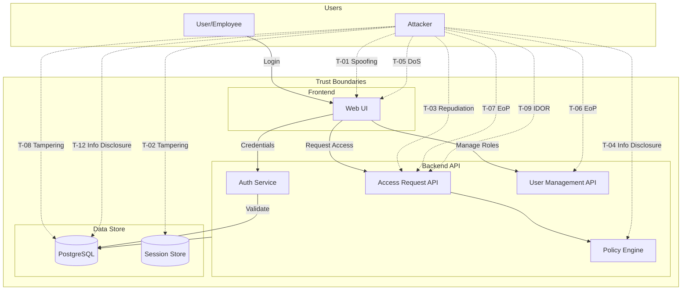

```mermaid
flowchart TD
    subgraph Users
        U[User/Employee]
        A[Attacker]
    end

    subgraph Boundaries [Trust Boundaries]
        subgraph WebApp [Frontend]
            UI[Web UI]
        end

        subgraph Backend [Backend API]
            Auth[Auth Service]
            Access[Access Request API]
            Admin[User Management API]
            Policy[Policy Engine]
        end

        subgraph Storage [Data Store]
            DB[(PostgreSQL)]
            Sessions[(Session Store)]
        end
    end

    U -->|Login| UI
    A -.->|T-01 Spoofing| UI
    A -.->|T-05 DoS| UI

    UI -->|Credentials| Auth
    Auth -->|Validate| DB
    A -.->|T-02 Tampering| Sessions

    UI -->|Request Access| Access
    A -.->|T-03 Repudiation| Access
    A -.->|T-07 EoP| Access
    A -.->|T-09 IDOR| Access
    
    UI -->|Manage Roles| Admin
    A -.->|T-06 EoP| Admin

    Access --> Policy
    A -.->|T-04 Info Disclosure| Policy

    Backend --> DB
    A -.->|T-08 Tampering| DB
    A -.->|T-12 Info Disclosure| DB
```
