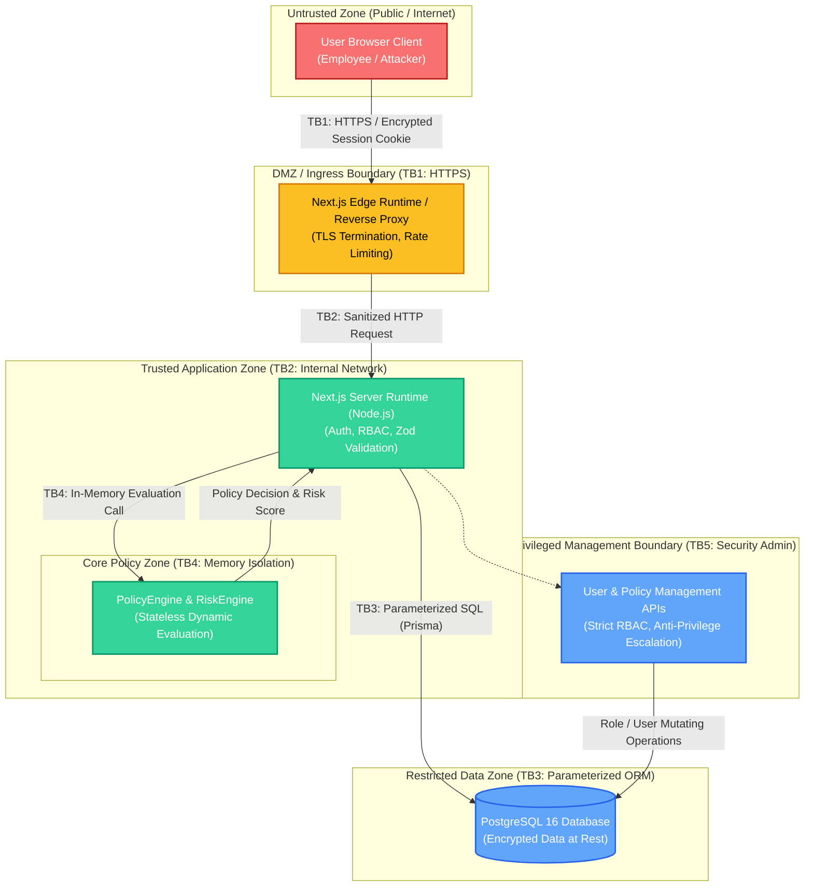

# ZTAP Trust Boundary Diagram

```mermaid
flowchart TD
    subgraph UntrustedZone ["Untrusted Zone (Public / Internet)"]
        UserBrowser["User Browser Client\n(Employee / Attacker)"]
    end

    subgraph SemiTrustedZone ["DMZ / Ingress Boundary (TB1: HTTPS)"]
        Ingress["Next.js Edge Runtime / Reverse Proxy\n(TLS Termination, Rate Limiting)"]
    end

    subgraph TrustedAppZone ["Trusted Application Zone (TB2: Internal Network)"]
        AppServer["Next.js Server Runtime (Node.js)\n(Auth, RBAC, Zod Validation)"]
        subgraph InternalEngineZone ["Core Policy Zone (TB4: Memory Isolation)"]
            PolicyEngine["PolicyEngine & RiskEngine\n(Stateless Dynamic Evaluation)"]
        end
    end

    subgraph RestrictedDataZone ["Restricted Data Zone (TB3: Parameterized ORM)"]
        PostgresDB[("PostgreSQL 16 Database\n(Encrypted Data at Rest)")]
    end

    subgraph AdminBoundaryZone ["Privileged Management Boundary (TB5: Security Admin)"]
        AdminAPI["User & Policy Management APIs\n(Strict RBAC, Anti-Privilege Escalation)"]
    end

    UserBrowser -- "TB1: HTTPS / Encrypted Session Cookie" --> Ingress
    Ingress -- "TB2: Sanitized HTTP Request" --> AppServer
    AppServer -- "TB4: In-Memory Evaluation Call" --> PolicyEngine
    PolicyEngine -- "Policy Decision & Risk Score" --> AppServer
    AppServer -- "TB3: Parameterized SQL (Prisma)" --> PostgresDB
    AppServer -.-> AdminAPI
    AdminAPI -- "Role / User Mutating Operations" --> PostgresDB

    classDef untrusted fill:#f87171,stroke:#b91c1c,stroke-width:2px,color:#fff;
    classDef semi fill:#fbbf24,stroke:#d97706,stroke-width:2px,color:#000;
    classDef trusted fill:#34d399,stroke:#059669,stroke-width:2px,color:#fff;
    classDef isolated fill:#60a5fa,stroke:#2563eb,stroke-width:2px,color:#fff;

    class UserBrowser untrusted;
    class Ingress semi;
    class AppServer,PolicyEngine trusted;
    class PostgresDB,AdminAPI isolated;
```
