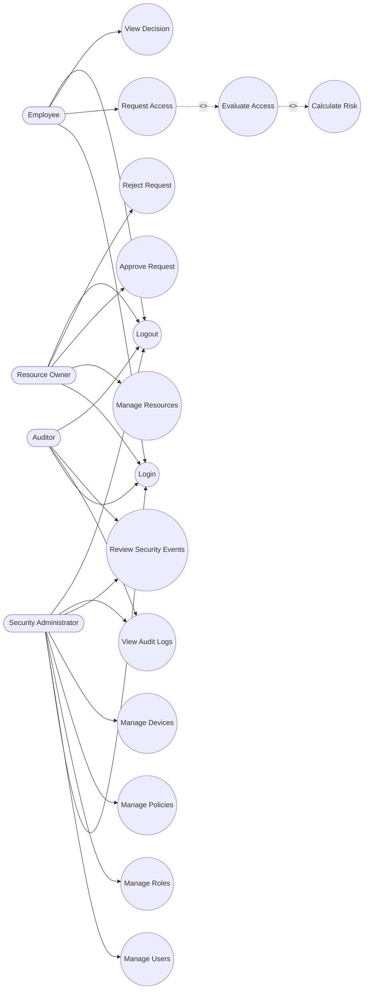

```mermaid
flowchart LR
    %% Actors
    Emp([Employee])
    Admin([Security Administrator])
    RO([Resource Owner])
    Auditor([Auditor])

    %% Use Cases
    Login((Login))
    ReqAccess((Request Access))
    EvalAccess((Evaluate Access))
    CalcRisk((Calculate Risk))
    ViewDec((View Decision))
    AppReq((Approve Request))
    RejReq((Reject Request))
    ManageUsers((Manage Users))
    ManageRoles((Manage Roles))
    ManageRes((Manage Resources))
    ManagePol((Manage Policies))
    ManageDev((Manage Devices))
    ViewAudit((View Audit Logs))
    RevSec((Review Security Events))
    Logout((Logout))

    %% Actor to Use Case relationships
    Emp --> Login
    Emp --> ReqAccess
    Emp --> ViewDec
    Emp --> Logout

    Admin --> Login
    Admin --> ManageUsers
    Admin --> ManageRoles
    Admin --> ManagePol
    Admin --> ManageDev
    Admin --> RevSec
    Admin --> ViewAudit
    Admin --> Logout

    RO --> Login
    RO --> ManageRes
    RO --> AppReq
    RO --> RejReq
    RO --> Logout

    Auditor --> Login
    Auditor --> ViewAudit
    Auditor --> RevSec
    Auditor --> Logout

    %% Includes/Extends
    ReqAccess -.->|<<include>>| EvalAccess
    EvalAccess -.->|<<include>>| CalcRisk
```
