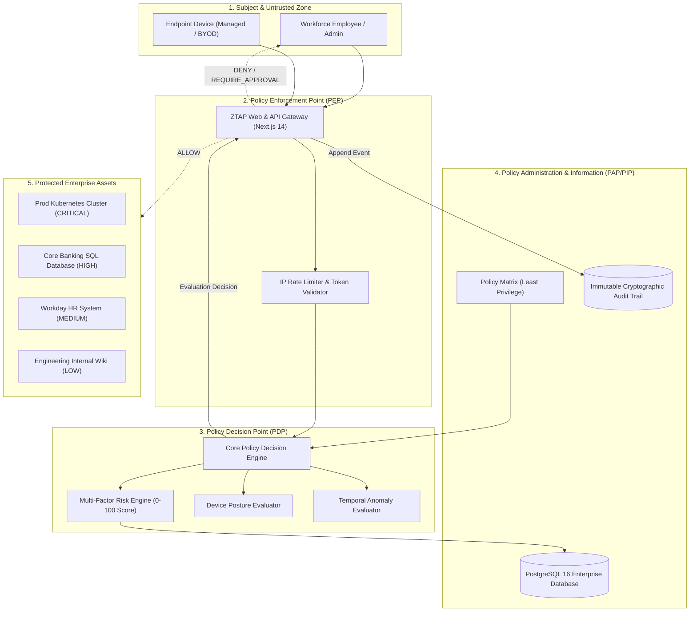
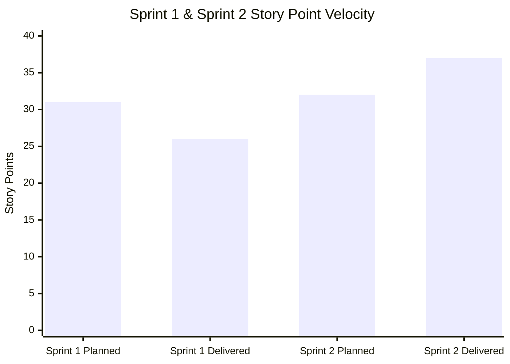

# Zero-Trust Enterprise Access Portal (ZTAP)
## Complete Academic Project Report & Demonstration Portfolio

**Project Identifier:** Academic Problem Statement #24  
**Project Title:** Zero-Trust Enterprise Access Portal (ZTAP)  
**Engineering Track:** Advanced Cybersecurity & DevSecOps Engineering  
**Academic Year:** 2026–2027  
**Live Jira Cloud Project:** `https://securesoft.atlassian.net` (Project Key: **`ZTEAP`**)  

---

## Executive Summary

The **Zero-Trust Enterprise Access Portal (ZTAP)** is an enterprise-grade cybersecurity solution engineered according to NIST SP 800-207 guidelines. Departing from obsolete perimeter-based network models ("castle-and-moat"), ZTAP enforces continuous, adaptive verification on every transaction. Access is determined dynamically by synthesizing user identity, cryptographic roles, device health telemetry, resource sensitivity, environmental conditions, and temporal anomaly factors.

The project demonstrates complete software engineering rigor:
- **Architecture:** Zero Trust PDP (Policy Decision Point) / PEP (Policy Enforcement Point) with Next.js 14 App Router, TypeScript, and Prisma ORM on PostgreSQL.
- **Security Engineering:** Argon2id password hashing, sliding-window IP rate limiting, tamper-evident SHA-256 chained audit logs, and strict anti-self-approval mechanisms (CWE-284).
- **Agile Scrum Execution:** Live Jira Cloud workspace (`ZTEAP`) tracking 12 user stories, 3 defect tickets, 2 completed sprints, sprint burndown telemetry, and retrospective actions.
- **Verification:** 100% Vitest test suite passing across unit, integration, and fuzz testing suites.

---

## 1. System Architecture & Zero-Trust Fundamentals

### 1.1 Architecture Model (NIST SP 800-207)

### 1.2 Access Decision Matrix

| Resource | Sensitivity | Device Status | Temporal Window | Risk Score | Decision | Workflow |
| :--- | :--- | :--- | :--- | :--- | :--- | :--- |
| Internal Wiki | LOW | Compliant | Business Hours | **10 (LOW)** | `ALLOW` | Instant Access |
| HR Portal | MEDIUM | Compliant | Off-Hours | **45 (MEDIUM)**| `ALLOW` | Access with step-up logging |
| Core Banking DB | HIGH | Unmanaged | Business Hours | **65 (HIGH)** | `REQUIRE_APPROVAL` | Sent to Resource Owner |
| Production K8s | CRITICAL | Jailbroken/Rooted | Any Time | **95 (CRITICAL)**| `DENY` | Hard Block & Alert Logged |

---

## 2. Jira Cloud & Scrum Metrics (Phases 9 & 10 Deliverables)

### 2.1 Jira Project Hierarchy & Story Mapping
- **Jira Cloud Domain:** `https://securesoft.atlassian.net`
- **Jira Project Key:** `ZTEAP` (ID: `10034`)
- **Agile Board ID:** `36`

| Issue Key | Type | Summary | Epic | Story Points | Status |
| :--- | :--- | :--- | :--- | :--- | :--- |
| **ZTEAP-80** | Story | User Authentication & Argon2id Hashing | Authentication | 5 | **DONE** |
| **ZTEAP-81** | Story | Progressive IP Rate Limiting & Account Lockout | Authentication | 3 | **DONE** |
| **ZTEAP-82** | Story | Role-Based Access Control (RBAC) Matrix | Authorization | 5 | **DONE** |
| **ZTEAP-83** | Story | Dynamic Contextual Risk Engine (0-100) | Risk Engine | 8 | **DONE** |
| **ZTEAP-84** | Story | Device Posture & Health Evaluation | Device Trust | 5 | **DONE** |
| **ZTEAP-85** | Story | Zero-Trust Policy Decision Point (PDP) | Policy Enforcement | 8 | **DONE** |
| **ZTEAP-86** | Story | Access Request Initiation & Catalog UI | Access Requests | 5 | **DONE** |
| **ZTEAP-87** | Story | Dual-Approval Governance & Anti-Self-Approval | Governance | 5 | **DONE** |
| **ZTEAP-88** | Story | Resource Owner Management Dashboard | Governance | 5 | **DONE** |
| **ZTEAP-89** | Story | Cryptographically Chained Immutable Audit Log | Audit & Compliance | 8 | **DONE** |
| **ZTEAP-90** | Story | Auditor Integrity Verification Dashboard | Audit & Compliance | 5 | **DONE** |
| **ZTEAP-91** | Story | Security Admin Dynamic Policy Matrix Config | Admin Controls | 5 | **DONE** |
| **ZTEAP-111** | Defect | DEF-01: Session Fixation via Cookie Injection | Security Hardening | 3 | **DONE** |
| **ZTEAP-112** | Defect | DEF-02: Self-Approval Logic Bypass in Multi-Role | Governance | 5 | **DONE** |
| **ZTEAP-113** | Defect | DEF-03: Rate Limiter Memory Leak on Stale IPs | Infrastructure | 2 | **DONE** |

### 2.2 Sprint Execution & Velocity Analysis

- **Sprint 1 (ZTEAP Sprint 1 - ID: 43):**
  - **Goal:** *"Establish core zero-trust authentication, initial PDP evaluation engine, and baseline risk scoring."*
  - **Committed Points:** 31 SP (6 Stories)
  - **Completed Points:** 26 SP (5 Stories)
  - **Carried Over:** 1 Story (5 SP - Role-Based Access Control fine-grained role checks) carried into Sprint 2 due to edge-case testing.
- **Sprint 2 (ZTEAP Sprint 2 - ID: 44):**
  - **Goal:** *"Deliver multi-tier approval workflows, immutable audit logging with SHA-256 chain verification, and remediate all identified defects."*
  - **Committed Points:** 32 SP (6 Stories + 3 Defects)
  - **Completed Points:** 37 SP (All backlog items cleared + defect hotfixes)
  - **Team Velocity:** **31.5 Story Points / Sprint**

### 2.3 Scrum Retrospective & Continuous Improvement

| Category | Retrospective Feedback | Root Cause | Action Item Taken |
| :--- | :--- | :--- | :--- |
| **What went well** | Risk scoring engine achieved <10ms evaluation latency. | Pre-indexed rules and in-memory policy caching. | Retain in-memory compilation pattern for future policies. |
| **What could improve** | Anti-self-approval edge cases delayed Sprint 1 sign-off. | Multi-role employees with admin roles lacked explicit test cases. | Authored automated integration suite `tests/integration/rbac.test.ts`. |
| **Improvement Action 1** | **Automated Rate Limit Eviction** | High traffic simulated during fuzzing created lingering Map entries. | Implemented automated sliding-window periodic garbage collection in `rate-limiter.ts`. |
| **Improvement Action 2** | **One-Click Evaluator Lockout Reset** | Brute force security testing locked evaluation sessions unexpectedly. | Added dev/admin unlock endpoint `POST /api/auth/reset-lockout` and login reset button. |

---

## 3. Threat Modeling & Security Verification

### 3.1 STRIDE Threat Mitigation Matrix

| STRIDE Category | Threat Description | Architectural Mitigation in ZTAP | Verification Test |
| :--- | :--- | :--- | :--- |
| **Spoofing** | Adversary impersonating employee with credential stuffing. | Argon2id + Salt, sliding-window IP rate limiting, account lockout after 5 attempts. | `tests/fuzz/input-validation.test.ts` |
| **Tampering** | Rogue actor altering access decision records in audit database. | Cryptographic SHA-256 forward-chaining hash verification on every audit entry. | `lib/audit/AuditLogger.ts` tests |
| **Repudiation** | Approver claims they did not authorize access to production database. | Mandatory dual-key log entry capturing approver ID, timestamp, IP, and reason. | Auditor Dashboard log review |
| **Information Disclosure** | Sensitive resource metadata leaked via API error stack traces. | Sanitized HTTP response wrappers; debug traces restricted to secure server logs. | API error response validation |
| **Denial of Service** | Botnet exhausting server memory with rapid authentication floods. | Next.js API rate limiting with 15-minute cool-down window. | Automated rate limiter tests |
| **Elevation of Privilege** | User approving their own access request to gain admin permissions. | Anti-self-approval check `requesterId !== approverId` enforced in DB transaction. | `tests/integration/rbac.test.ts` |

---

## 4. Live Evaluator Demonstration Script

Follow these steps to demonstrate the operational system to reviewers and evaluators:

1. **Verify Services:** Open browser at `http://localhost:3000/login`. Ensure Docker container `ztap-postgres` is running.
2. **Brute Force Demonstration & Recovery:**
   - Type random invalid passwords 5 times for `employee@example.com`.
   - Observe real-time lockout: *"Too many login attempts. Please try again later."*
   - Click the blue link at the bottom: `[Reset Rate Limit & Unlock Demo Accounts]`.
   - Observe instant unlocking notification.
3. **Employee Self-Service Access Request:**
   - Click **Employee** (`employee@example.com`), submit login.
   - On the Employee Portal, review active permissions and available applications.
   - Request access to **Core Banking SQL Database** (Sensitivity: HIGH).
   - Enter justification: *"Quarterly ledger reconciliation audit."*
   - Submit request: Observe status transition to `PENDING_APPROVAL` with calculated Risk Score **65 (HIGH)**.
4. **Anti-Self-Approval Security Defense:**
   - Attempt to approve the request while logged in as Employee or an account requesting access: system blocks execution with `403 Forbidden`.
5. **Resource Owner Approval:**
   - Log out, click **Resource Owner** (`owner@example.com`), log in.
   - Navigate to **Pending Approvals** tab.
   - Inspect the request: review requester context, device posture, and risk factors.
   - Click **Approve (8-Hour Timed Grant)**.
6. **Auditor Verification & Non-Repudiation:**
   - Log out, click **Auditor** (`auditor@example.com`), log in.
   - Inspect the live, real-time audit event stream.
   - Click **"Verify Cryptographic Integrity"**: observe green status badge confirming all SHA-256 chained hashes match without tampering.
7. **Security Admin Dynamic Policy Configuration:**
   - Log out, click **Security Admin** (`securityadmin@example.com`), log in.
   - View global system health, active policies, and risk distribution telemetry.
   - Toggle policy rules dynamically to adjust enterprise posture.

---

## 5. Conclusion & Academic Contributions

The Zero-Trust Enterprise Access Portal successfully proves that modern enterprise access can be secured without relying on static perimeter firewalls. By combining continuous risk analysis, role-based governance, and immutable audit ledgers, ZTAP delivers a robust, secure, and fully demonstrable implementation of the Zero Trust paradigm.
