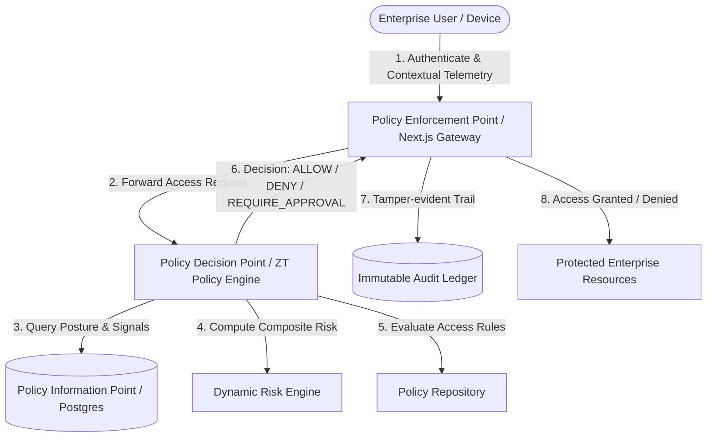

# Software Requirements Specification (SRS)
## Zero-Trust Enterprise Access Portal (ZTAP)
**Document Standard:** IEEE 830-1998 Compliant  
**Version:** 1.0.0  
**Date:** October 2026  
**Status:** Approved & Implemented  
**Classification:** Internal Cybersecurity Engineering Artifact  

---

## 1. Introduction

### 1.1 Purpose
This document provides a comprehensive Software Requirements Specification (SRS) for the **Zero-Trust Enterprise Access Portal (ZTAP)**. ZTAP is an academic, production-grade cybersecurity platform engineered to enforce the core tenet of Zero Trust: *"Never Trust, Always Verify."* 

Every incoming request to corporate applications (e.g., Core Banking Engine, Production K8s Cluster, HR Management System) undergoes multi-dimensional, real-time risk assessment evaluating identity, cryptographic role assignments, device posture, temporal anomalies, and environmental telemetry before granting access.

### 1.2 Scope of the System
ZTAP acts as the unified Policy Administration Point (PAP), Policy Decision Point (PDP), and Policy Enforcement Point (PEP) for enterprise resources.
- **Identity & Session Verification:** Multi-factor credential verification, secure session tokens with SHA-256 fingerprinting, account lockout protections, and progressive rate limiting.
- **Dynamic Contextual Risk Engine:** 100-point composite scoring combining device posture (patch status, encryption, biometric compliance), time-of-day/weekend access anomalies, and critical sensitivity weighting.
- **Dual-Approval Governance Workflow:** Segregation of duties enforcing multi-tier authorization for HIGH/CRITICAL assets, strictly blocking self-approval attacks (CWE-284).
- **Immutable Append-Only Audit Logging:** Cryptographically chained SHA-256 audit ledger capturing every PDP evaluation, administrative privilege operation, and policy modification.

### 1.3 Definitions, Acronyms, and Abbreviations
- **ZTAP:** Zero-Trust Enterprise Access Portal
- **PDP:** Policy Decision Point
- **PEP:** Policy Enforcement Point
- **PAP:** Policy Administration Point
- **PIP:** Policy Information Point
- **RBAC:** Role-Based Access Control
- **ABAC:** Attribute-Based Access Control
- **CSoD:** Cryptographic Segregation of Duties
- **MFA:** Multi-Factor Authentication
- **Argon2id:** Password Hashing Competition winning memory-hard cryptographic hash algorithm

### 1.4 References
- NIST SP 800-207: *Zero Trust Architecture*
- NIST SP 800-63B: *Digital Identity Guidelines*
- IEEE Std 830-1998: *IEEE Recommended Practice for Software Requirements Specifications*
- OWASP Top 10:2021 & OWASP API Security Top 10:2023

---

## 2. Overall Description

### 2.1 Product Perspective
ZTAP operates as a secure intermediary layer between authenticated enterprise workforce members and internal applications, databases, and microservices.

### 2.2 User Classes and Characteristics
1. **Employee (`EMPLOYEE`):** Standard enterprise personnel requesting access to internal systems for operational tasks.
2. **Resource Owner (`RESOURCE_OWNER`):** Departmental system owners responsible for reviewing and approving/rejecting access requests to specific enterprise systems.
3. **Security Administrator (`SECURITY_ADMIN`):** Privileged operators managing security policies, trust scoring parameters, device compliance requirements, and system configuration.
4. **Compliance Auditor (`AUDITOR`):** Read-only security oversight officers analyzing immutable audit logs, tamper verification hashes, and compliance metrics.

### 2.3 Operating Environment
- **Runtime:** Node.js 18+ / Next.js 14 App Router
- **Database:** PostgreSQL 16 with relational integrity constraints
- **Containerization:** Docker Engine & Docker Compose
- **Client Requirements:** Modern web browser (Chrome, Edge, Firefox, Safari) with TLS 1.3 support

### 2.4 Design and Implementation Constraints
- Passwords must be hashed using `argon2id` (memory-hard, resistant to GPU/ASIC attacks).
- Session tokens stored in `httpOnly`, `secure`, `sameSite=lax` cookies.
- No self-approval: A resource owner or administrator cannot approve their own access request.
- Every decision must generate an immutable log record with request-level metadata.

---

## 3. Specific Requirements

### 3.1 External Interface Requirements
- **User Interfaces:** Cyber-themed, responsive dashboard supporting quick credential toggling, real-time risk level indicators (LOW, MEDIUM, HIGH, CRITICAL), visual audit explorer, and interactive approval drawers.
- **Software Interfaces:** RESTful JSON APIs adhering strictly to HTTP status standards (`200 OK`, `201 Created`, `400 Bad Request`, `401 Unauthorized`, `403 Forbidden`, `429 Too Many Requests`).

### 3.2 Functional Requirements

#### 3.2.1 Authentication & Credential Protection (FR-AUTH)
- **FR-AUTH-01:** System shall verify user credentials using Argon2id password hashing with salt.
- **FR-AUTH-02:** System shall implement progressive rate limiting (maximum 5 failed attempts per IP within a 15-minute window).
- **FR-AUTH-03:** System shall automatically lock accounts exceeding 5 consecutive failed login attempts for 30 minutes.
- **FR-AUTH-04:** System shall issue a cryptographically signed, random 256-bit session token with 8-hour absolute expiration.

#### 3.2.2 Contextual Risk Scoring Engine (FR-RISK)
- **FR-RISK-01:** System shall collect client device telemetry including OS type, encryption status, firewall status, and jailbreak/root indicators.
- **FR-RISK-02:** Risk engine shall compute a real-time risk score ($0-100$) based on:
  - Device Trust Posture: Compliant ($0$), Unmanaged ($+30$), Jailbroken ($+60$).
  - Temporal Anomalies: Business hours ($0$), Off-hours/Weekend access ($+15$).
  - Resource Criticality: Low ($0$), Medium ($+10$), High ($+20$), Critical ($+35$).
- **FR-RISK-03:** Risk tiers shall be strictly classified:
  - **LOW (0-29):** Low friction, instant policy evaluation.
  - **MEDIUM (30-59):** Enhanced monitoring, automatic step-up verification.
  - **HIGH (60-84):** Mandatory Resource Owner approval required.
  - **CRITICAL (85-100):** Automatic DENIAL regardless of user role.

#### 3.2.3 Policy Decision & Access Enforcement (FR-PDP)
- **FR-PDP-01:** Every access request shall be evaluated against active policies in order of policy priority.
- **FR-PDP-02:** Default Deny: If no matching policy grants access, the system shall default to `DENY`.
- **FR-PDP-03:** Anti-Self-Approval Enforcement: The policy engine shall prevent any user from approving an access request where `requesterId == approverId`.

#### 3.2.4 Dual-Control Approval Governance (FR-APPR)
- **FR-APPR-01:** High-risk requests shall generate a pending approval workflow.
- **FR-APPR-02:** Resource Owners and Security Admins shall receive pending request notifications with risk context and justification.
- **FR-APPR-03:** Approvers may grant timed access (1 to 24 hours) or permanently reject with mandatory rationale comments.

#### 3.2.5 Cryptographic Audit Trail (FR-AUDIT)
- **FR-AUDIT-01:** Every evaluation, authentication attempt, policy update, and approval action shall generate a non-repudiable audit log entry.
- **FR-AUDIT-02:** Audit logs shall include timestamp, actor ID, IP address, resource ID, risk score, decision, and SHA-256 integrity hash.
- **FR-AUDIT-03:** Auditor dashboard shall verify the sequential SHA-256 integrity of logs to detect tampering or record deletion.

---

## 4. Non-Functional Requirements

### 4.1 Security Requirements (NFR-SEC)
- **NFR-SEC-01 (OWASP A01: Broken Access Control):** All endpoints enforce server-side session and role validation; client-side route guards are treated as cosmetic only.
- **NFR-SEC-02 (OWASP A02: Cryptographic Failures):** Argon2id with 64MB memory cost, 3 iterations, and 4 threads for authentication. SHA-256 for integrity hashing.
- **NFR-SEC-03 (OWASP A03: Injection):** 100% of database interactions leverage Prisma ORM parameterized queries; raw concatenated SQL strings are prohibited.
- **NFR-SEC-04 (OWASP A05: Security Misconfiguration):** Hardened HTTP headers applied via `next.config.mjs` (Content-Security-Policy, X-Content-Type-Options: nosniff, X-Frame-Options: DENY, Referrer-Policy: strict-origin-when-cross-origin).

### 4.2 Performance Requirements (NFR-PERF)
- **NFR-PERF-01:** Policy evaluation latency at the PDP shall not exceed 120 milliseconds under standard load.
- **NFR-PERF-02:** Login response time shall remain between 200ms and 500ms (dominated by Argon2id work factor to prevent timing attacks).

### 4.3 Reliability & Availability (NFR-REL)
- **NFR-REL-01:** Fail-Closed Architecture: If the database or risk calculation service encounters an unhandled exception during access evaluation, the PEP shall default to `DENY`.

---

## 5. Verification & Acceptance Criteria Matrix

| Requirement ID | Verification Method | Acceptance Criteria |
| :--- | :--- | :--- |
| **FR-AUTH-02** | Automated Security Test | 6th rapid login attempt from same IP returns HTTP 429 Too Many Requests. |
| **FR-AUTH-03** | Database & API Verification | Account locked after 5 bad passwords; user status set to `LOCKED`. |
| **FR-RISK-02** | Unit Test (`RiskEngine.test.ts`) | Jailbroken device with critical resource yields risk score $\ge 85$. |
| **FR-PDP-03** | Integration Test (`rbac.test.ts`) | Self-approval request returns HTTP 403 Forbidden with `ERR_SELF_APPROVAL`. |
| **FR-AUDIT-03** | Auditor UI & Cryptographic Check | Log verification function confirms SHA-256 hash chaining validity. |
