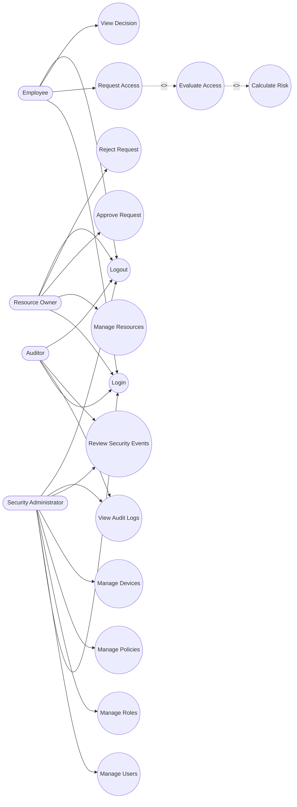

# Phase 3 - UML Documentation

## 1. Use Case Diagram

The Zero-Trust Access Portal (ZTAP) use cases encompass actions taken by four core actors: Employee (User), Security Administrator, Resource Owner, and Auditor.

## 2. Critical Use Case 1: Request Access to Internal Application

- **Actor**: Employee
- **Preconditions**: User is authenticated, device is registered, resource exists and is active.
- **Main Flow**: 
  1. Employee selects a targeted resource.
  2. Employee enters the justification or reason for access.
  3. Employee submits the access request.
  4. System captures current device context and information.
  5. Policy engine evaluates the request against RBAC and ABAC rules.
  6. Risk engine generates a risk score (0-100).
  7. Access decision is returned to the user.
  8. Audit log entry is created.
- **Alternative Flow**: 
  - *Step-Up Auth*: If Risk Score is 60-80, the system sets status to `STEP_UP_AUTHENTICATION` requiring MFA. 
  - *Approval Needed*: If the Resource is highly sensitive and requires manual override, the status is set to `REQUIRE_APPROVAL`.
- **Exception Flow**: 
  - *Compromised Device*: If device trust evaluates to `COMPROMISED`, immediate `DENY`.
  - *Inactive User*: If user account is suspended or inactive, immediate `DENY`.
  - *Missing Resource*: If the requested resource is inactive or removed, system throws an error.
- **Postconditions**: An `AccessRequest` entity is created, an `AccessDecision` is recorded, and an `AuditLog` entry is firmly stored.

## 3. Critical Use Case 2: Evaluate Access Request

- **Actor**: System (Policy Engine)
- **Preconditions**: A valid `AccessRequest` payload is received.
- **Main Flow**: 
  1. Validate the user identity and session token.
  2. Check role authorization via RBAC policies.
  3. Evaluate device trust (`TRUSTED`, `COMPLIANT`, `UNTRUSTED`, `COMPROMISED`).
  4. Check resource sensitivity and access constraints.
  5. Evaluate temporal conditions (e.g., business hours restrictions).
  6. Calculate the aggregate risk score via the Risk Engine.
  7. Aggregate all evaluations to formulate a final `ALLOW`, `DENY`, `STEP_UP_AUTHENTICATION`, or `REQUIRE_APPROVAL` decision.
  8. Generate a detailed decision reason string.
- **Alternative Flow**: 
  - *Missing Device Info*: System assigns maximum device risk (100) or fails open/closed depending on global strictness.
  - *Implicit Role Allowance*: If a role is not explicitly allowed, check for wildcard access policies or organizational defaults.
- **Exception Flow**: 
  - *Policy Engine Error*: Output `DENY` securely and log an internal error alert.
  - *Database Unavailable*: Output `DENY` securely and surface a system error gracefully to the user.
- **Postconditions**: `AccessDecision` generated comprising the decision flag, string reason, calculated risk score, and detailed contributing factors.

## 4. Scenario-Based Analysis: "Employee Requests Access to Sensitive Internal Application"

- **Scenario**: John (Employee) requests access to the Finance System (HIGH sensitivity) from his managed laptop during business hours.
- **Walkthrough**:
  1. **Initiation**: John logs into ZTAP, navigates to his dashboard, and requests access to the "Finance System".
  2. **Data Capture**: ZTAP captures John's identity, his laptop's device signature, and the current timestamp.
  3. **Device Trust Check**: The laptop is verified against the Device Store and marked as `TRUSTED` and `COMPLIANT`.
  4. **Role Evaluation**: John's role (`Finance Analyst`) is evaluated. The policy confirms the role has baseline permission for the system.
  5. **Risk Calculation**: Because the device is `TRUSTED`, the time is within normal business hours, and the location is recognized, the Risk Engine scores the transaction at `15` (Low Risk).
  6. **Policy Decision**: The Policy Engine aggregates these vectors. Since the risk is below 60 and RBAC aligns, the system grants an `ALLOW` decision.
  7. **Audit & Fulfillment**: An `AccessDecision` is saved to the database and John is securely routed to the Finance System interface.
