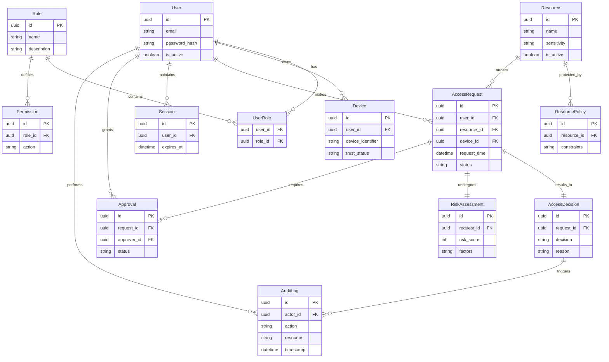
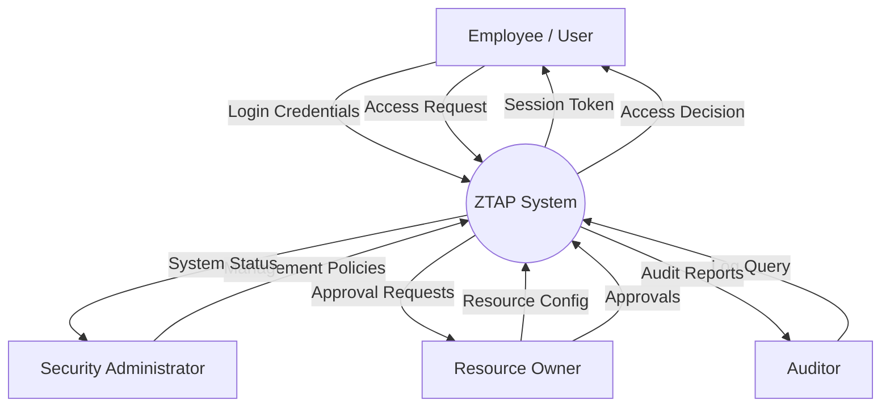
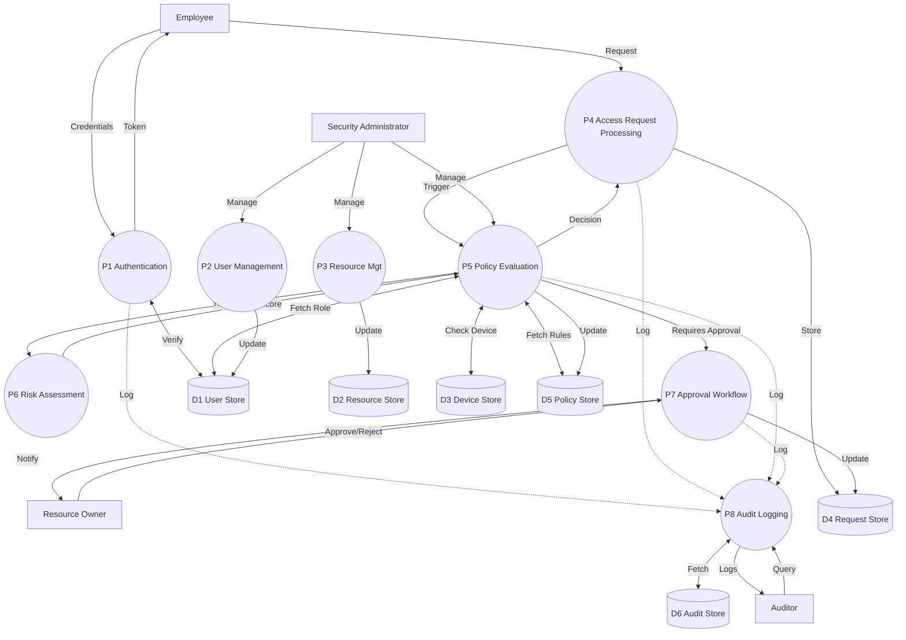

# Phase 4 - Data and Information Flow

## 1. Entity-Relationship (ER) Diagram

## 2. DFD Level 0 (Context Diagram)

The Level 0 Data Flow Diagram outlines the highest level of abstraction for the Zero-Trust Access Portal (ZTAP). 

## 3. DFD Level 1

The Level 1 DFD decomposes the ZTAP system into primary functional processes and associated data stores.

## 4. Trust Boundaries

Trust boundaries delineate different levels of trust within the application's architecture:

- **TB1: User Browser → Frontend**: Low-trust boundary. Input must be validated. XSS/CSRF protections are necessary.
- **TB2: Frontend → Backend API**: Crossing from the public network into the internal network structure. Requires strict authentication, rate-limiting, and CORS controls.
- **TB3: Backend → Database**: High-trust inner boundary. Protects against SQLi using an ORM (Prisma). Minimal privileges assigned to the DB credentials.
- **TB4: Backend → Policy Engine**: Internal integration point evaluating zero-trust rules. Output determines access state, so responses must be cryptographically verified if decoupled.
- **TB5: Admin Interface → Security Management APIs**: Privileged boundary. Strict RBAC enforcement and heightened audit logging apply to all administrative interactions.

## 5. Consistency Check

- **Use Cases mapped to DFD Processes**: 
  - `Login` is executed in `P1 Authentication`.
  - `Request Access` triggers `P4 Access Request Processing`.
  - `Evaluate Access` and `Calculate Risk` are handled by `P5 Policy Evaluation` and `P6 Risk Assessment`.
  - `Manage Users`, `Roles`, `Policies`, and `Resources` correspond directly to `P2 User Management`, `P3 Resource Management`, and associated stores.
- **Use Cases mapped to ER Entities**: 
  - Initiating an Access Request creates an `AccessRequest` entity.
  - Policy execution pulls from `ResourcePolicy`, `Role`, `UserRole`, `Device`, and creates an `AccessDecision` and `RiskAssessment`.
- **Entity consistency**: All items inside `D1 User Store`, `D2 Resource Store`, etc., map exactly to the entities detailed in the ER diagram ensuring the data and workflow maintain a 1-to-1 parity structurally.
