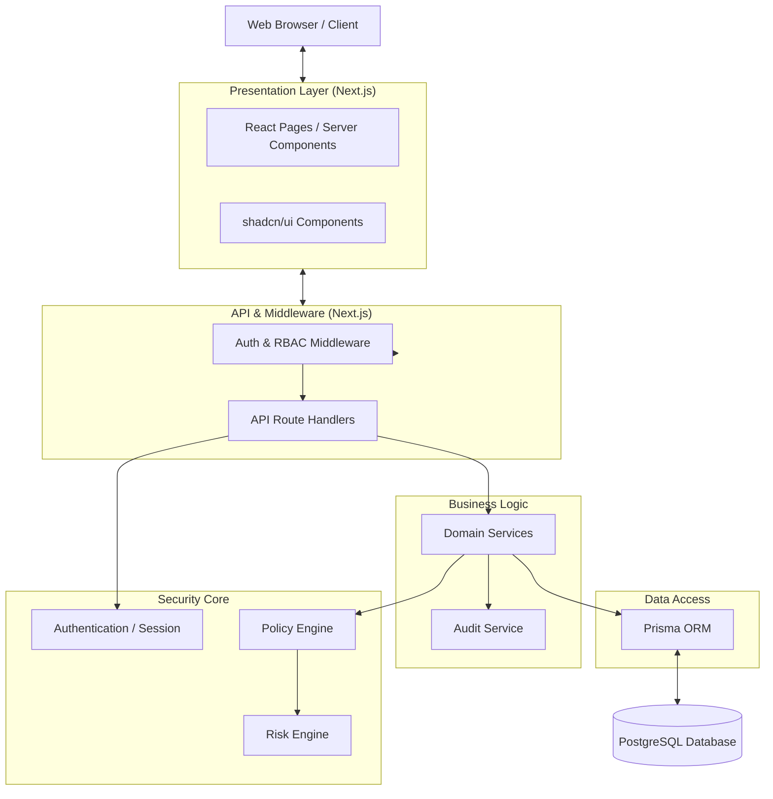
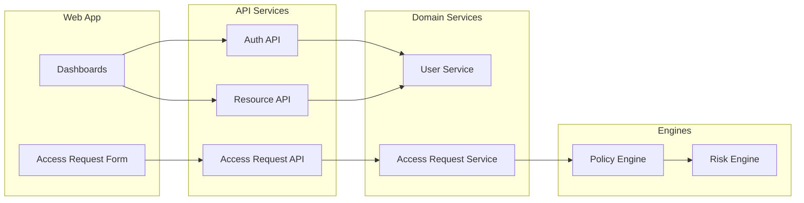
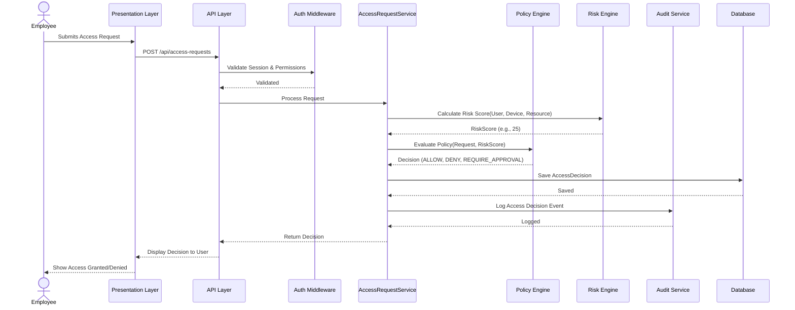

# Phase 5: Architecture Documentation

## Secure Layered Architecture

The Zero-Trust Enterprise Access Portal (ZTAP) utilizes a secure layered architecture to separate concerns, maintain trust boundaries, and enforce zero-trust principles at every level.

- **Presentation Layer**: Next.js pages, React components (Client Components and Server Components), and shadcn/ui elements. Responsible for rendering the UI and handling user interactions.
- **API Layer**: Next.js Route Handlers exposing RESTful endpoints. Responsible for request parsing, validation (Zod), and initial routing.
- **Authentication Layer**: Manages sessions using `iron-session` (encrypted, HTTP-only cookies) and handles password hashing/verification using Argon2id. Enforces MFA checks.
- **Authorization Layer**: RBAC middleware and fine-grained permission checks. Ensures the authenticated user possesses the correct roles and permissions before allowing business logic execution.
- **Policy Engine**: A strategy-based evaluation pipeline that applies `ResourcePolicy` rules against incoming `AccessRequest`s. Evaluates identity, device trust, resource sensitivity, time, and environment context.
- **Risk Engine**: Factor-based risk calculation module. Evaluates anomalous behaviors, location, device health, and historical access patterns to generate a risk score (0-100).
- **Business Logic Layer**: Core services (`UserService`, `AccessRequestService`) encapsulating the domain rules and workflows.
- **Audit Service**: Immutable logging service recording all security-relevant events, access decisions, and state changes for compliance and analysis.
- **Data Access Layer**: Prisma ORM interacting with PostgreSQL. Responsible for data persistence, transaction management, and query optimization.

## Design Patterns

ZTAP employs several well-established design patterns to ensure maintainability and security.

- **Repository Pattern**: `UserRepository` and `ResourceRepository` abstract database operations via Prisma, allowing the business logic to remain agnostic of the underlying ORM and facilitating unit testing.
- **Service Layer Pattern**: Core logic is encapsulated in services like `AccessRequestService`, coordinating interactions between the repository, Policy Engine, and Audit Service.
- **Strategy Pattern**: The Policy Engine employs interchangeable evaluators (`IdentityEvaluator`, `DeviceEvaluator`, `TimeEvaluator`). This allows the system to evaluate diverse policies dynamically without modifying core engine logic.
- **Factory Pattern**: A `RiskCalculatorFactory` dynamically instantiates the appropriate risk calculators based on the user's context and the resource type being accessed.
- **Middleware Pattern**: Cross-cutting security concerns (Authentication validation, RBAC checks, Rate Limiting, Security Headers) are implemented as composable Next.js middleware, ensuring they are executed prior to reaching API endpoints.
- **Policy Object / Specification Pattern**: The `ResourcePolicy` entity encapsulates complex access rules as composable conditions (e.g., `RequiresTrustedDevice AND IsDuringBusinessHours`), separating policy definition from policy evaluation.

## Architecture Diagram

## Component Diagram

## Sequence Diagram: Access Request Flow

## Technology Justification

| Technology | Purpose | Justification |
|------------|---------|---------------|
| Next.js | Full-stack React Framework | Provides SSR/SSG for performance, API routes for backend logic, and robust file-based routing. Simplifies deployment. |
| TypeScript | Language | Enforces strict type safety across the stack, reducing runtime errors and improving developer experience and code maintainability. |
| PostgreSQL | Relational Database | Offers ACID compliance, structured schema, and robust indexing essential for transactional consistency in access management and auditing. |
| Prisma ORM | Data Access | Provides a type-safe database client. Abstracts complex SQL queries and integrates seamlessly with TypeScript. |
| Tailwind CSS | Styling | Utility-first CSS framework enabling rapid, consistent UI development without context switching. |
| shadcn/ui | UI Components | Accessible, customizable component library that provides a professional look and feel without vendor lock-in. |
| Argon2id | Password Hashing | Current industry standard for secure password hashing. Resistant to GPU cracking and side-channel attacks. |
| iron-session | Session Management | Stateless, encrypted, HTTP-only cookie-based sessions. Prevents database lookups for session validation and mitigates CSRF. |
| Docker / K8s | Containerization & Orchestration | Ensures consistent environments from development to production. Kubernetes provides scaling and high availability. |
