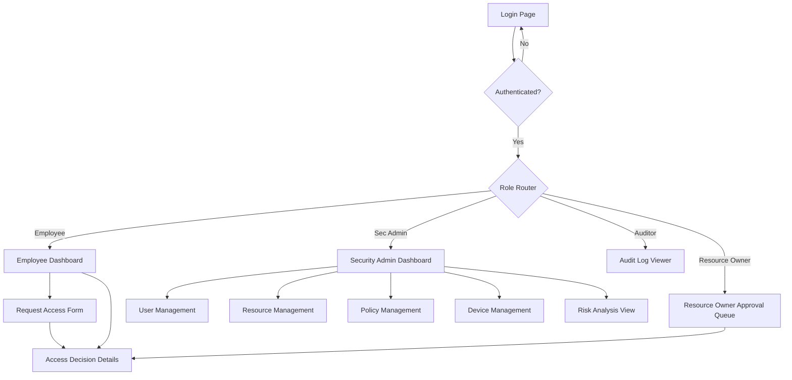

# Phase 6: UI Design Documentation

## Core Usability Principles Applied
- **Consistency**: Uniform layout utilizing a standard sidebar navigation, consistent color palette, and reusable components (shadcn/ui).
- **User control**: Prominent "Cancel" and "Back" buttons on forms. Destructive actions require explicit confirmation.
- **Feedback**: Global loading indicators, skeleton screens for asynchronous data, and toast notifications for success/error events.
- **Error prevention**: Client-side form validation via Zod, clear input requirements, and confirmation dialogs for critical actions.
- **Navigation**: Role-based sidebar menu, breadcrumbs indicating current location, and clear page titles.
- **Visibility**: Access decisions clearly display risk scores, security levels, and the reasoning behind decisions.

## Navigation Flow

## Screen Documentation

### 1. Login Page
- **User/Role**: All users.
- **Goal**: Authenticate users securely into the ZTAP portal.
- **Navigation**: Landing page (`/login`). Upon success, redirects to the role-appropriate dashboard.
- **Inputs**: Username/Email, Password, optionally MFA token.
- **Feedback**: Loading spinner on submit.
- **Errors**: "Invalid credentials", "Account locked", validation errors for empty fields.
- **Security considerations**: Generic error messages to prevent username enumeration. Rate-limited to prevent brute force attacks.

### 2. Employee Dashboard
- **User/Role**: Employee/User.
- **Goal**: Overview of active sessions, recent access requests, and quick links to request new access.
- **Navigation**: Accessed via `/dashboard`. Links to Request Access Form and specific Access Decision Details.
- **Inputs**: Filter/Search recent requests.
- **Feedback**: Skeleton loaders for initial data fetch.
- **Errors**: Network errors display retry button.
- **Security considerations**: Only shows data owned by the logged-in user. Strict tenant isolation.

### 3. Request Access Form
- **User/Role**: Employee/User.
- **Goal**: Submit a structured request for access to a specific enterprise resource.
- **Navigation**: Accessed from Employee Dashboard. Submits to Access Decision Details upon completion.
- **Inputs**: Resource dropdown/search, Justification text area, Duration requested.
- **Feedback**: Toast notification on successful submission. Loading state on button.
- **Errors**: Client-side validation for required fields.
- **Security considerations**: Resource list is pre-filtered to only show resources the user is permitted to request.

### 4. Access Decision Details
- **User/Role**: Employee, Security Administrator, Resource Owner.
- **Goal**: Display the outcome of an access request, including policy reasoning and risk score.
- **Navigation**: Reached from Dashboard or Approval Queue.
- **Inputs**: None for Employee. Owners/Admins may have "Approve/Deny" action buttons.
- **Feedback**: Visual indicators for ALLOW (green), DENY (red), PENDING (yellow).
- **Errors**: "Access Denied" if attempting to view an unauthorized request ID.
- **Security considerations**: IDOR prevention ensures users can only view their own requests, unless they hold an Admin/Owner role managing that specific request.

### 5. Security Administrator Dashboard
- **User/Role**: Security Administrator.
- **Goal**: High-level overview of system security posture, active alerts, and quick management links.
- **Navigation**: Accessed via `/admin/dashboard`. Links to management pages.
- **Inputs**: Date range filters for charts.
- **Feedback**: Interactive charts and data refreshing indicators.
- **Errors**: Standard data fetch errors.
- **Security considerations**: Route strictly protected by RBAC middleware requiring `ADMIN` role.

### 6. User Management
- **User/Role**: Security Administrator.
- **Goal**: Manage user accounts, assign roles, and review individual user risk profiles.
- **Navigation**: Accessed from Admin Dashboard.
- **Inputs**: Search bar, role filters, user edit forms.
- **Feedback**: Toast on role update. Confirmation modal before disabling a user.
- **Errors**: Validation errors on form submission.
- **Security considerations**: Prevents self-locking or privilege escalation vulnerabilities.

### 7. Resource Management
- **User/Role**: Security Administrator, Resource Owner.
- **Goal**: Register new applications/resources and define their sensitivity levels.
- **Navigation**: Accessed from Admin Dashboard.
- **Inputs**: Form for resource name, type, sensitivity classification, owner assignment.
- **Feedback**: Success toast on resource creation.
- **Errors**: Name collision errors.
- **Security considerations**: Resource Owners can only manage resources assigned to them.

### 8. Policy Management
- **User/Role**: Security Administrator.
- **Goal**: Define and manage ResourcePolicies (the rules dictating access).
- **Navigation**: Accessed from Admin Dashboard.
- **Inputs**: Complex policy builder UI (conditions, target resources, required trust levels).
- **Feedback**: Validation feedback on policy syntax/logic.
- **Errors**: Syntax errors in policy definition.
- **Security considerations**: Audit logging tracks all policy modifications, detailing who changed what and when.

### 9. Device Management
- **User/Role**: Security Administrator.
- **Goal**: View device inventory, manually override device trust states (TRUSTED, UNTRUSTED, COMPROMISED).
- **Navigation**: Accessed from Admin Dashboard.
- **Inputs**: Search by MAC/IP/User. Action buttons to update status.
- **Feedback**: State change confirmations.
- **Errors**: Action failure alerts.
- **Security considerations**: Marking a device as COMPROMISED immediately terminates all active sessions associated with it.

### 10. Audit Log Viewer
- **User/Role**: Auditor, Security Administrator.
- **Goal**: Search, filter, and export immutable security event logs.
- **Navigation**: Accessed via `/audit`.
- **Inputs**: Advanced filtering (date, event type, actor, resource), export buttons (CSV/PDF).
- **Feedback**: Progress bar during export generation.
- **Errors**: Query timeout handling.
- **Security considerations**: Read-only interface. No modification capabilities exist.

### 11. Resource Owner Approval Queue
- **User/Role**: Resource Owner.
- **Goal**: Review and disposition pending access requests for owned resources.
- **Navigation**: Accessed via `/approvals`.
- **Inputs**: Bulk selection checkboxes, Approve/Deny buttons, justification text input for decision.
- **Feedback**: Toast on successful disposition. Item removed from queue.
- **Errors**: Concurrency errors if request was handled by another owner.
- **Security considerations**: Enforces that owners only see requests explicitly requiring their approval.

### 12. Risk Analysis View
- **User/Role**: Security Administrator.
- **Goal**: Deep dive into the Risk Engine's outputs, viewing factor breakdowns for specific users or requests.
- **Navigation**: Accessed from Admin Dashboard or Access Decision Details.
- **Inputs**: Filter by risk threshold (e.g., Score > 80).
- **Feedback**: Detailed breakdown charts of risk factors.
- **Errors**: Data unavailability notices.
- **Security considerations**: Exposes sensitive behavioral data; strictly limited to administrators.
