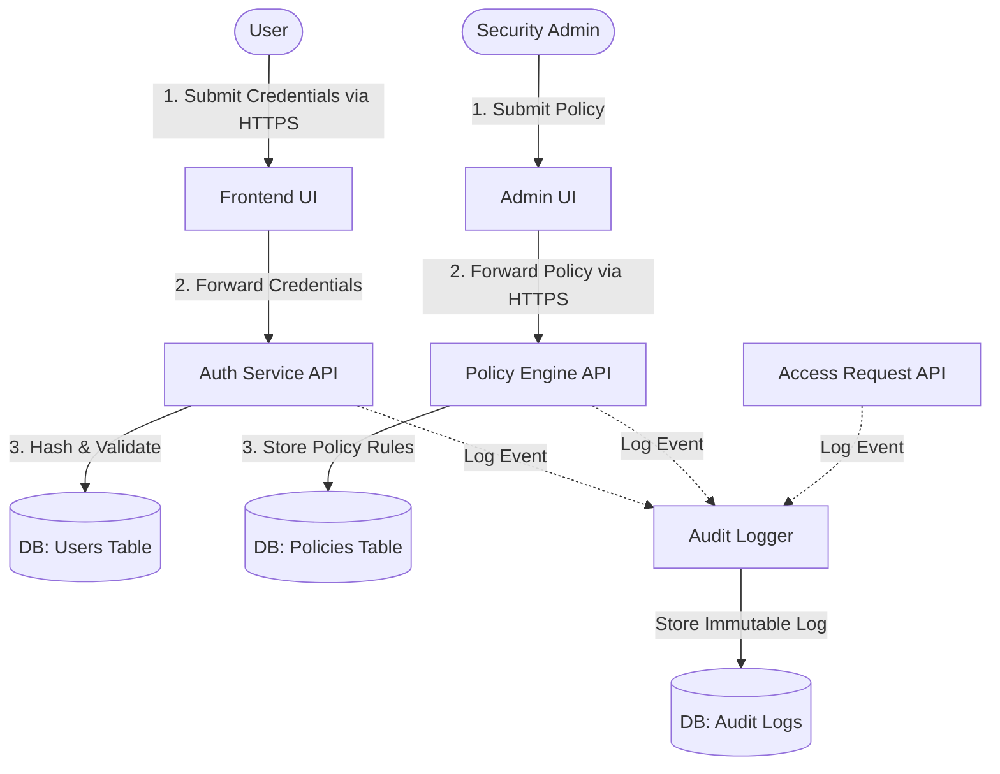

# Phase 8: Information Flow Analysis

## Sensitive Asset Analysis

### 1. Authentication Credentials
*   **Source**: User Browser (Frontend)
*   **Destination**: Authentication Service (Backend)
*   **Trust Boundary**: TB1 (Browser to Network), TB2 (Network to Backend API)
*   **Transformation**: Plaintext (at input) → Argon2id hash (at storage/verification)
*   **Storage**: PostgreSQL `users` table (`passwordHash` column)
*   **Security Controls**: HTTPS in transit, Argon2id hashing, no logging of plaintext passwords.

### 2. Access Policies
*   **Source**: Security Administrator
*   **Destination**: Policy Engine
*   **Trust Boundary**: TB4 (Admin Browser to Network), TB5 (Network to Backend API)
*   **Transformation**: JSON policy rules (UI) → evaluated conditions (Memory)
*   **Storage**: PostgreSQL `resource_policies` table
*   **Security Controls**: RBAC enforcement, admin-only access, comprehensive audit logging of all policy changes.

### 3. Audit Logs
*   **Source**: All system components (Auth, Policy Engine, Resource API)
*   **Destination**: Audit Log Store
*   **Trust Boundary**: TB3 (Backend API to Database)
*   **Transformation**: Structured Event Object (Memory) → Immutable Record (Database)
*   **Storage**: PostgreSQL `audit_logs` table
*   **Security Controls**: Append-only design, removal of sensitive data before logging, tamper-detection mechanisms.

## Information Flow Diagram

